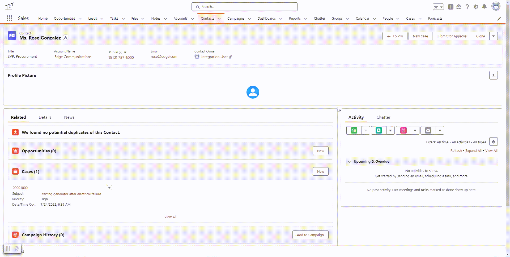

# Contact Profile Image LWC

Upload, crop, and save a profile image to a Contact record in Salesforce using this package. This repo offers a framework that may be altered to allow an org to load/crop images in other contexts. 

## Package Contents

### Lightning Web Components

#### *imageCropper*

An image cropping LWC. This component allows a user to upload an image and scale and crop the image as desired. The user can then save or present the result.

This component is developed using the Croppie JavaScript library: [Croppie](https://foliotek.github.io/Croppie/). Furthermore, Pradeep Hegde's tutorial on using Croppie within an LWC was very important in putting this together: [Crop images using LWC and External JS library!](https://medium.com/cloudwerx/crop-images-using-lwc-and-external-js-library-bc0feed9d5d8)

#### *uploadImageModal*

This LWC is a [lightning-modal](https://developer.salesforce.com/docs/component-library/bundle/lightning-modal/documentation). This modal is launched by a parent component (in this repo, it is launched by *contactProfileImage*). This component houses the *imageCropper* component, and it passes data between the parent and the *imageCropper* LWC.

#### *contactProfileImage*

Specific to this context, this LWC loads an existing profile photo from a Contact record and/or saves a profile image to a Contact record. This LWC is responsible for rendering the final version of the profile image.

If implementing in a different context or with a different use case, you will likely create your own parent component to launch and manage the *uploadImageModal*. Alternatively, you may use *imageCropper* directly without *uploadImageModal* if you do not need a modal.

### Apex Classes

- **ImageCropperController** - Apex Controller of the *imageCropper* LWC.
- **ImageCropperControllerTest** - Test Class for ImageCropperController
- **ContactProfileImageController** - Apex Controller of the *contactProfileImage* LWC
- **ContactProfileImageControllerTest** - Test Class for ContactProfileImageController

### Custom Fields

- **Contact.ProfileImageDocumentId__c** - This field contains the ContentDocument Id of the ContentDocument record containing the cropped and scaled profile image.
- **Contact.ProfileImageMetadata__c** - This field stores the metadata of the image file being saved. 
    - **PLEASE NOTE** that the size attribute may be incorrect as the code is currently using the metadata from the original file loaded (and not retriveing/calculating the file size after cropping by Croppie). This may be a future enhancement.

### Static Resources

- **croppieCss** - This is the CSS file for styling the Croppie elements. Reference the [Croppie GitHub](https://github.com/foliotek/croppie) for the latest version.
- **croppieJs** - The Croppie JS file containing the Croppie functions. Reference the [Croppie GitHub](https://github.com/foliotek/croppie) for the latest version.

## Notes

- Reference Croppie's documentation (https://foliotek.github.io/Croppie/) for guidance on how to use Croppie.
- This has not been thoroughly tested on mobile
- This implementation does not save the original version of the image to Salesforce. Only the cropped and scaled image is saved. It is, however, possible to save the original version of the image should that be required.
- Rigorous Apex Testing is advised
- Tests have not been developed for LWCs
- Field Level Security needs to be defined in any orgs installing this code
- Rigorous testing of permissions and usability with different personas is advised

## About

*contact-profile-image-lwc* was developed by Loran Saggu through [Rooster Software LLC](rooster-software.com)